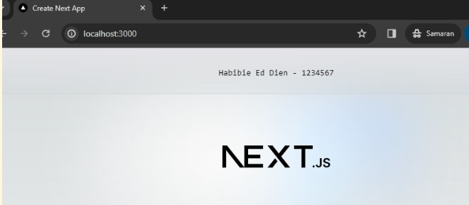
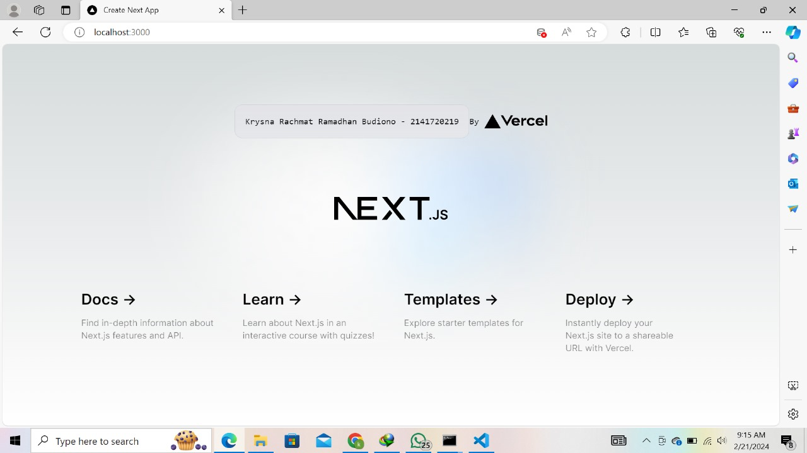
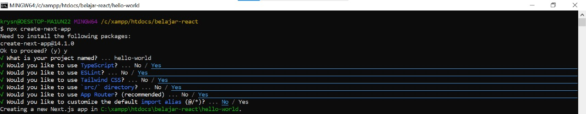
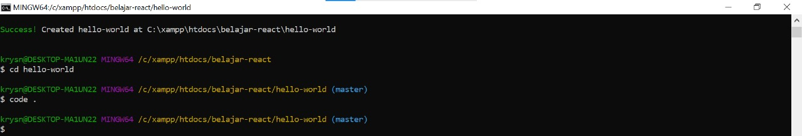
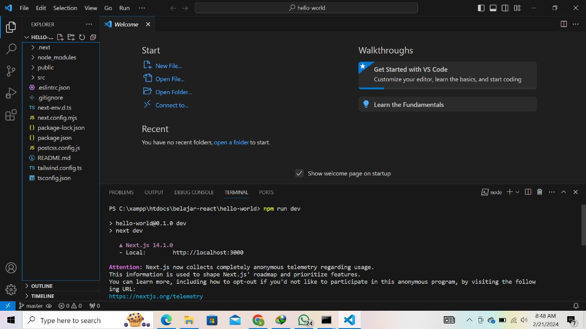
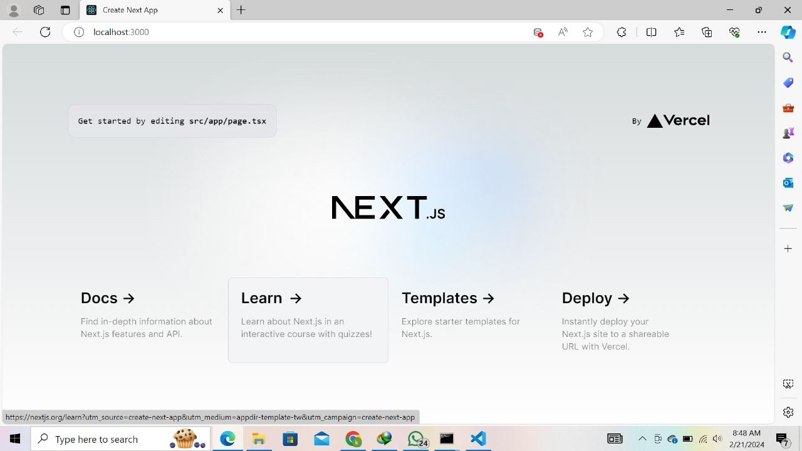

## ***Soal Praktikum | Week 02: belajar react***

### **Soal 1**
Pada gambar tersebut, silakan Anda browsing apa yang dimaksud dengan:

TypeScript
```
TypeScript adalah bahasa pemrograman yang merupakan superset dari JavaScript. Ini berarti bahwa TypeScript memperluas fitur-fitur JavaScript dengan menambahkan dukungan untuk tipe data statis. Dengan menggunakan Typescript, kita dapat  mendefinisikan tipe data untuk variabel, parameter, dan nilai kembali dari fungsi, sehingga memungkinkan Anda untuk menangkap kesalahan saat pengembangan aplikasi.
```
ESLint
```
ESLint adalah alat untuk Javascript yang digunakan untuk mengidentifikasi dan memperbaiki pola kode program yang tidak sesuai standar tertentu dan mencegah kesalahan umum
```

Tailwind CSS
```
Tailwind CSS adalah salah satu framework CSS yang dirancang untuk membangun antarmuka pengguna dengan menggunakan pendekatan utility-first
```
App Router
```
App Router adalah bagian kerangka kerja / perpustakaan Javascript yang digunakan untuk navigasi antara bagian dalam aplikasi web
```
Import alias
```
Import Alias adalah cara untuk memberikan nama alias untuk file PATH yang diimpor kedalam Javascript / Typescript
```

**Soal 2**
Pada struktur project tersebut, jelaskan kegunaan folder dan file masing-masing tersebut!
```
- node_modules = Direktori ini berisi  semua dependensi proyek yang diinstal melalui npm atau Yarn.

- public =  Direktori ini berisi aset publik seperti gambar, ikon, atau file CSS yang dapat diakses secara langsung oleh klien.

- src = Direktori ini berisi sebagai tempat untuk menyimpan kode sumber (source code) dari aplikasi atau proyek yang sedang dikembangkan.

- .eSlintrc.json = berkas konfigurasi untuk ESLint, yang digunakan untuk mengatur aturan dan konfigurasi linting untuk proyek JavaScript. ESLint adalah alat linting yang membantu dalam mengidentifikasi dan memperbaiki pola kode yang tidak sesuai dengan pedoman atau standar tertentu. Berkas .eslintrc.json berperan penting dalam menentukan aturan linting yang akan diterapkan pada kode proyek.

- gitignore = yang digunakan oleh Git untuk menentukan file dan direktori mana yang tidak akan dimasukkan ke dalam repositori Git. Git menggunakan. gitignore untuk mengabaikan file dan direktori yang tidak perlu dilacak atau disertakan dalam riwayat perubahan proyek.

- next-env.d.ts = digunakan dalam proyek Next.js untuk mendefinisikan tipe-tipe yang berkaitan dengan lingkungan pengembangan (environment). Berkas ini biasanya digunakan untuk menyediakan deklarasi tipe (type declarations) untuk variabel-variabel lingkungan yang dapat digunakan dalam proyek Next.js.

- next.config.mjs = adalah berkas konfigurasi Next.js yang ditulis dalam format ECMAScript Module (ESM). Berkas ini digunakan untuk menyesuaikan pengaturan proyek Next.js sesuai dengan kebutuhan spesifik.
Dalam berkas next.config.mjs, Anda dapat menentukan berbagai opsi konfigurasi, termasuk pengaturan untuk memodifikasi aturan webpack, menambahkan plugin Next.js khusus, mengonfigurasi path alias, menentukan environment variables, dan banyak lagi.

- package-lock.json = berkas yang digunakan oleh npm untuk merekam versi spesifik dari setiap paket yang diinstal dalam proyek. Berkas ini diciptakan secara otomatis oleh npm setiap kali Anda menjalankan perintah npm install atau npm ci.

- package.json = digunakan dalam proyek Node.js untuk menyimpan metadata terkait proyek dan daftar dependensi yang diperlukan. Berkas ini berperan penting dalam manajemen proyek Node.js dan memungkinkan Anda untuk mendefinisikan konfigurasi proyek, skrip yang dapat dijalankan, dan dependensi yang dibutuhkan.

- postcss.config.js = berkas konfigurasi untuk PostCSS, yang digunakan untuk melakukan transformasi pada kode CSS dengan menggunakan berbagai plugin. PostCSS adalah alat yang populer dalam ekosistem pengembangan web modern yang memungkinkan penggunaan fitur-fitur CSS baru, seperti variabel, nesting, dan mixin, dan mengubahnya menjadi CSS yang dapat didukung oleh berbagai browser.

- README.md = adalah berkas teks yang biasanya ditempatkan di direktori utama suatu proyek perangkat lunak. Ini berfungsi sebagai dokumen pengantar atau penjelasan singkat tentang proyek tersebut, dan sering kali menjadi titik awal bagi pengguna dan pengembang yang ingin memahami proyek tersebut.

- tailwind.config.ts = adalah berkas konfigurasi untuk Tailwind CSS, sebuah kerangka kerja CSS yang memungkinkan pengembang untuk dengan cepat membangun antarmuka pengguna dengan menggunakan kelas-kelas bawaan yang telah disediakan.

- tsconfig.json = berkas konfigurasi untuk TypeScript, sebuah bahasa pemrograman yang merupakan superset dari JavaScript yang mendukung tipe data statis. Berkas ini digunakan untuk mengatur pengaturan kompilasi TypeScript dalam proyek kita.
```
3. Soal 3
Gantilah teks pada bagian atas dengan Nama - NIM Anda. Contoh seperti gambar berikut:

Jawaban dibuktikan dengan hasil screenshot.
Ketika Anda telah berhasil mengganti teks tersebut, Anda tidak perlu menjalankan perintah npm run dev dan tidak juga diperlukan me-reload halaman di browser. Tiba-tiba perubahan itu tampil, Mengapa terjadi demikian? Jelaskan!
```
karena React.js mendukung fitur hot reload. Fitur ini memungkinkan pengembang untuk melihat perubahan yang mereka buat dalam kode secara langsung tanpa perlu menyegarkan halaman secara manual. Ketika fitur hot reload diaktifkan, setiap kali Anda menyimpan perubahan dalam kode JavaScript atau JSX, perubahan tersebut akan langsung diterapkan secara otomatis ke aplikasi web Anda tanpa perlu memuat ulang seluruh halaman.
``` 


##

## ***Dokumentasi Membuat Project Next-Js***
membuat project Next-Js menggunakan gitbash

setelah selesai membuat project lalu masuk dengan mengetikkan
```
cd hello-world

code.
```


contoh default dari next-js 



